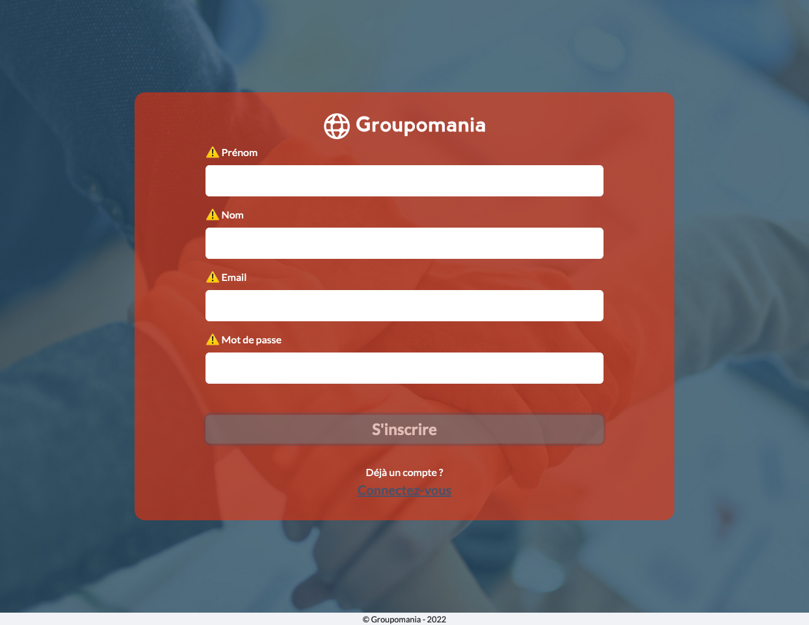
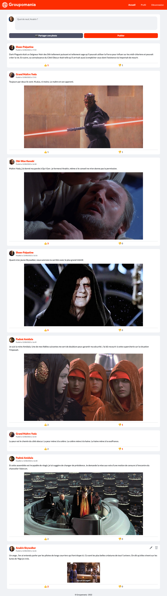
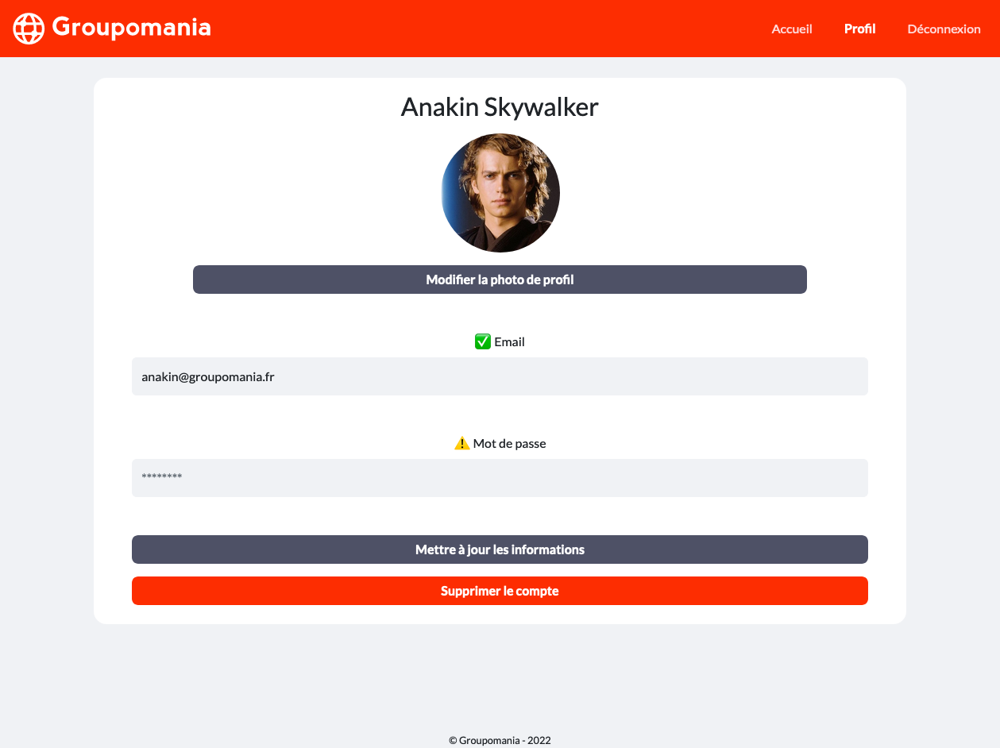

# Groupomania

Projet n°7 du [parcours Développeur Web](https://openclassrooms.com/fr/paths/556-developpeur-web#path-tabs) d'OpenClassrooms : _Créez un réseau social d’entreprise_.

> Il s'agit de créer intégralement un réseau social d'entreprise dans lequel les membres pourront échanger des images ou des textes. Une fonction de like/dislike a également été implémentée.

## 🔧 Prérequis

Afin de pouvoir exécuter l'application sur votre poste, vous devez d'aborder installer les dépendances suivantes :

- NodeJS
- `npm`
- MySQL

Pour les installer, sélectionner la version correspondant à votre système d'exploitation sur [cette page](https://nodejs.org/fr/download/) puis suivez les étapes d'installation.

## 📚 Technologie utilisées

- Frontend
  - VueJS
  - Bootstrap
  - Axios
- Backend
  - NodeJS
  - Express
  - MySQL
  - Sequelize

## 📦 Installation des packages

Dans le dossier **backend**, avec le terminal, exécutez la commande `npm install` pour installer les packages requis pour le fonctionnement de l'API.
Dans le dossier **frontend**, avec le terminal, exécutez la commande `npm install` pour installer les packages requis pour le fonctionnement du front.

## 🔐 Variables d'environnement

Dans le dossier **backend**, créez le fichier **.env**.
Dans ce fichier, déclarez les variables suivantes :

```
DB_HOST=localhost
DB_PORT=3306
DB_NAME=groupomania
DB_USER=
DB_PASSWORD=

JWT_SECRET=
JWT_DURING=24 hour
```

`DB_USER` et `DB_PASSWORD` sont les identifiants de connexion à MySQL sur votre machine.
`JWT_SECRET` est une clé de sécurité utilisée pour la création de token de session utilisateur

## ⚙️ Exécution

Pour démarrer le serveur, dans le dossier **backend**, avec le terminal, exécutez la commande `npm run dev`.
Si tout se passe bien, le message suivant devrait s'afficher dans le terminal :

```
Server is running on port 3000.
```

Pour démarrer le serveur d'affichage du frontend, dans le dossier **frontend**, avec le terminal, exécutez la commande `npm run serve`.
Par défaut, l'application est accessible en local via le port 8080 à l'adresse [http://localhost:8080/](http://localhost:8080/).

## 📎 Rendu visuel




